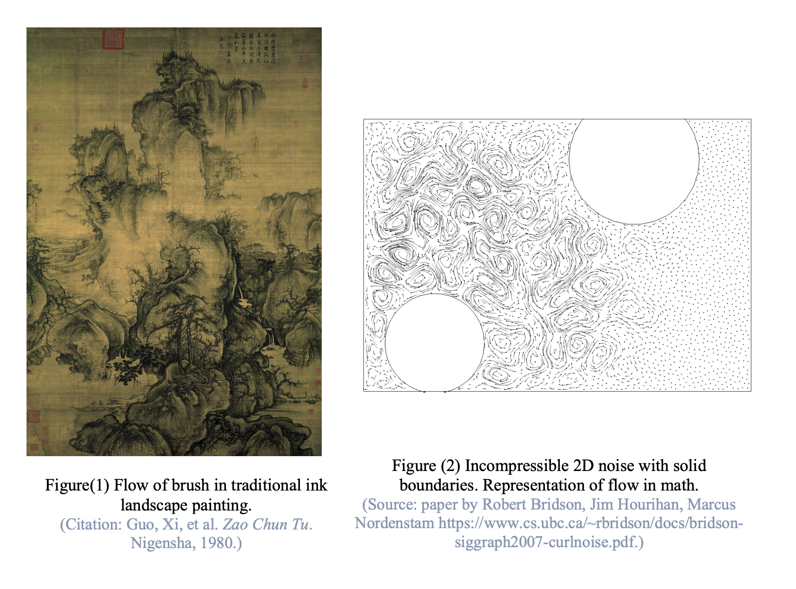

# Flow_Art Project

## Description

Flow_Art is a project that can transform a normal image into dynamic and visually stunning art pieces inspired by the concept of flow and movement.

## Inspiration

The inspiration behind Flow_Art stems from my fascination with the flow of the brush in East Asian traditional landscape painting (Figure 1) and the techniques used in Impressionist paintings. Beyond the realm of art, I was thrilled to discover that the flow of movement can also be explained mathematically through vector fields (Figure 2). This revelation inspired me to merge mathematics and coding to encapsulate my aesthetic appreciation for the 'flow of the spirit' within animated digital art, giving birth to this project.

## Features

- **Dynamic Art Generation**: Utilizes procedural generation techniques to create art that is ever-changing and never repeats.
- **Interactive**: Offers viewers the ability to interact with the art pieces, influencing the flow and outcome of the art.
- **Mutisensory**: Provides a choice of background music.

## Check out the video demo!

https://luluyueyiwang.com/flowart/

## Sources that provided me inspiration (Thank you!):
-djwolfson.weebly.com/perlin-noise.html
-codepen.io/HappiestMeal/pen/GwQrjq

